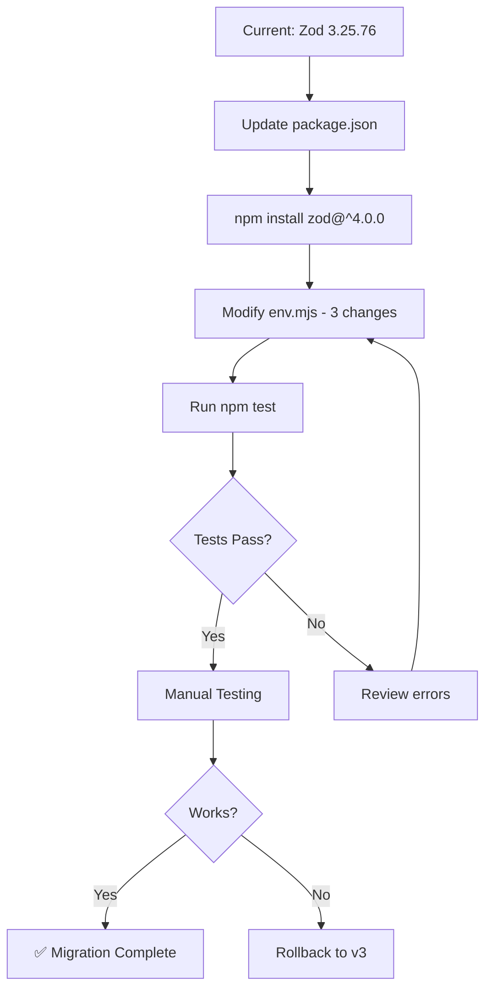

# Zod v4 Migration Summary

## Quick Overview

**Impact Level**: 🟢 **LOW** - Only 1 file needs changes  
**Estimated Time**: ~1 hour (including testing)  
**Risk Level**: Low

---

## Changes Required

### Single File to Modify: `game/src/env.mjs`

```javascript
// Three changes needed:

// 1. Line 8: Update z.string().url() → z.url()
DATABASE_URL: z.url(),

// 2. Line 35: Replace .merge() with object destructuring
const merged = z.object({
  ...server.shape,
  ...client.shape,
});

// 3. Line 55: Replace .flatten() with z.treeifyError()
z.treeifyError(parsed.error).fieldErrors
```

---

## Migration Flow



---

## Impact by Area

| Area | Files Affected | Breaking Changes | Status |
|------|----------------|------------------|--------|
| Environment Validation | 1 file | 3 locations | ⚠️ Needs Update |
| tRPC Routers | 7 files | None | ✅ No Changes |
| Tests | 1 file | None | ✅ No Changes |
| Other Code | N/A | None | ✅ No Changes |

---

## Upgrade Command

```bash
cd game
npm install zod@^4.0.0
```

---

## Rollback Command

```bash
cd game
npm install zod@^3.25.76
git checkout src/env.mjs
```

---

## Key Points

1. ✅ **Minimal Impact**: Only environment validation file needs changes
2. ✅ **No tRPC Changes**: All router schemas work as-is
3. ✅ **No Test Changes**: Test suite runs without modifications
4. ✅ **Performance Gains**: Zod v4 is significantly faster
5. ✅ **Simple Rollback**: Easy to revert if issues arise

---

## Next Steps

1. Review the detailed plan: [`zod-v4-migration-plan.md`](./zod-v4-migration-plan.md)
2. Switch to **Code mode** to implement changes
3. Run test suite after changes
4. Perform manual testing
5. Monitor for any runtime issues

---

## Questions Before Proceeding?

- Are there any specific validation scenarios you're concerned about?
- Do you want to see the exact code changes before implementation?
- Should we implement this now or schedule for later?
